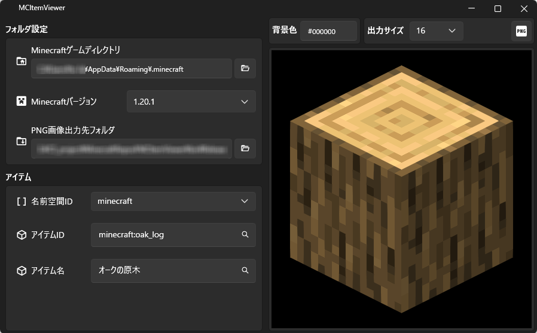
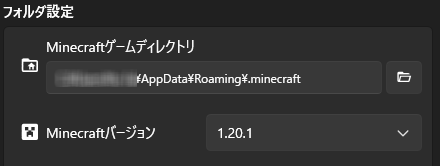
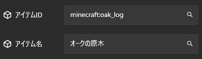

# MCItemViewer

Minecraftを起動せずにアイテムを閲覧できるツールです。

表示したアイテムを画像として出力することもできます。

## 🌟 Features

- 指定されたMinecraftのバージョンにあるアイテムを表示します。
- 表示されたアイテムを画像(PNG形式)に出力できます。

## 🖥️ System requirements

- Windows 10 64bit
- Windows 11 64bit

## ⭕ Supported Minecraft versions

Minecraft Java Edition 1.13以降

## ☑️ Operation confirmed versions

- 1.13
- 1.20.1
- 1.21.3
- 1.21.4
- 1.21.5

## 🧩 Usage

1. Minecraftゲームディレクトリとバージョンを設定します。

   

2. アイテムID or アイテム名を入力します。

   ※1 サジェスト機能付きです。

   ※2 現在のバージョンでは、名前空間は「minecraft」固定です。

   

3. 右側に入力したアイテムが表示されます。

   ※アイテムID or アイテム名を入力しても、実際のアイテムが表示されない場合もあります。

4. 表示中のアイテムを画像化する場合は、出力サイズ(ピクセル)を選択し、右側にある「PNG出力」ボタンを押してください。

   「PNG画像出力先フォルダ」で指定した場所に画像が出力されます。

   

## 😔 Not supported (Will be supported in the future)

- チェストやベッドなどのブロックエンティティは表示されません。
- 1.21.4以降では、草などのアイテムにバイオームの色が反映されていない場合があります。
- MODで追加されるアイテムは未対応です。
- 対応言語は日本語のみです。
